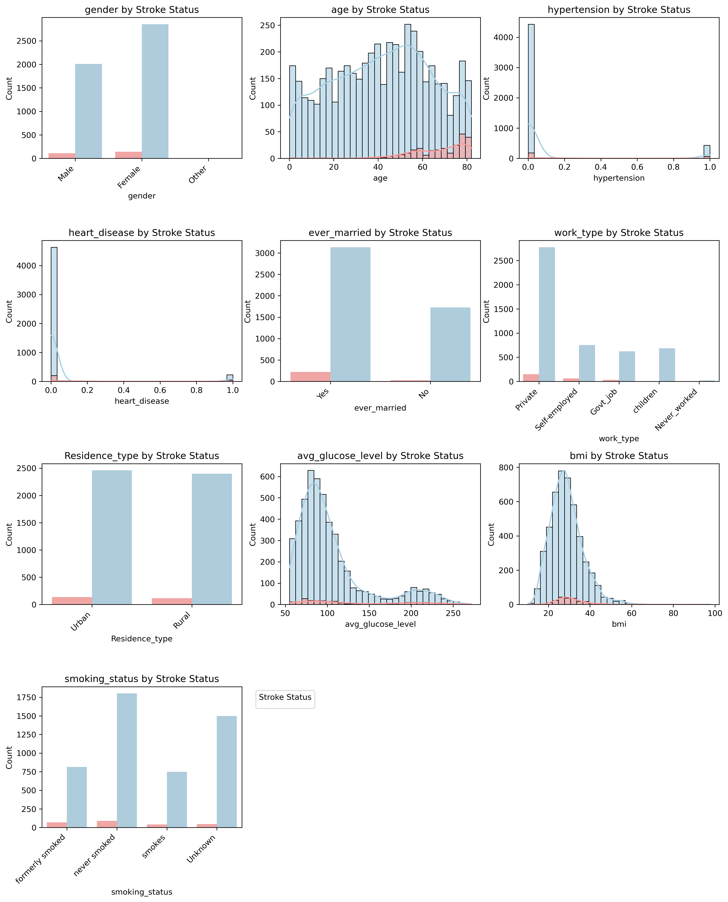
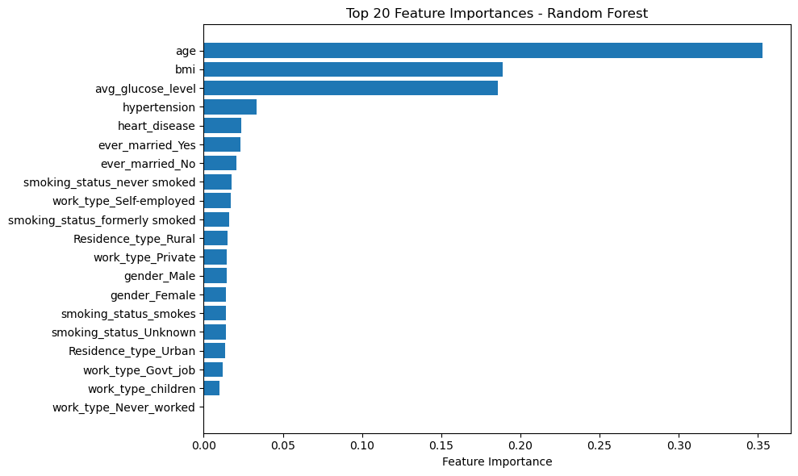
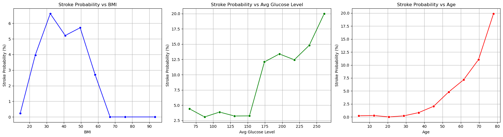
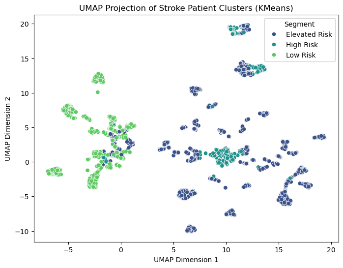
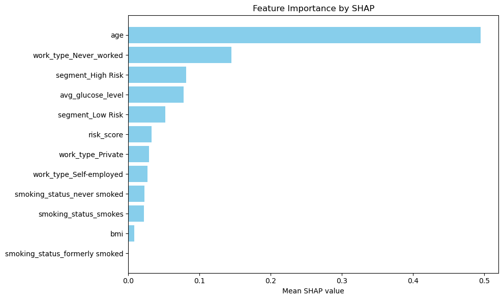

# Stroke Prediction with Machine Learning

---

## Table of Contents

1. [Introduction & Dataset Overview](#1-introduction--dataset-overview)  
2. [Data Cleaning and Preprocessing](#2-data-cleaning-and-preprocessing)  
3. [Exploratory Data Analysis](#3-exploratory-data-analysis)  
4. [Feature Engineering](#4-feature-engineering)  
5. [Model Selection and Development](#5-model-selection-and-development)  
6. [Handling Class Imbalance](#6-handling-class-imbalance)  
7. [Model Evaluation](#7-model-evaluation)  
8. [Interpretability and Explainability](#8-interpretability-and-explainability)  
9. [Deployment](#9-deployment)  
10. [Challenges and Lessons Learned](#10-challenges-and-lessons-learned)  

---

## 1. Introduction & Dataset Overview

### 1.1 Background and Motivation

Stroke remains one of the foremost causes of death and long-term disability worldwide. It occurs when the blood supply to the brain is interrupted or reduced, leading to brain cell death due to lack of oxygen and nutrients. According to the World Health Organization, approximately 15 million people suffer a stroke each year, with nearly 5 million deaths and 5 million survivors experiencing permanent disabilities.

This project explores the application of ML techniques to predict stroke occurrence using clinical and demographic data from the Kaggle Stroke Prediction Dataset. The goal is to build an accurate, interpretable, and deployable model that can aid healthcare providers and patients alike in stroke risk assessment.

---

### 1.2 Dataset Description

The dataset used in this study is publicly available on Kaggle and contains records for 5,110 patients, each described by 12 features, including the binary target variable indicating whether the patient had a stroke.

The features are summarized below:

| Feature           | Description                                                    |
|-------------------|----------------------------------------------------------------|
| **id**            | Unique patient identifier                                      |
| **gender**        | Patient’s gender: Male, Female, or Other                       |
| **age**           | Patient age in years                                           |
| **hypertension**  | Binary indicator: 1 if patient has hypertension, else 0       |
| **heart_disease** | Binary indicator: 1 if patient has heart disease, else 0      |
| **ever_married**  | Marital status: Yes or No                                      |
| **work_type**     | Patient’s work type: Govt_job, Private, Self-employed, Children, Never_worked |
| **Residence_type**| Urban or Rural residence                                       |
| **avg_glucose_level** | Average blood glucose level                                 |
| **bmi**           | Body Mass Index (some values missing)                         |
| **smoking_status**| Smoking status: formerly smoked, never smoked, smokes, unknown |
| **stroke**        | Target variable: 1 if stroke occurred, 0 otherwise            |

---

### 1.3 Initial Observations and Challenges

The dataset presents several important characteristics and challenges that shaped the modeling approach:

#### 1.3.1 Imbalanced Target Classes

- Stroke cases represent approximately 4.9% (249 out of 5,110) of the dataset, making the classification task highly imbalanced. This imbalance could cause models to be biased towards predicting the majority “no stroke” class if unaddressed.

#### 1.3.2 Missing Values

- The **bmi** feature contains missing values for about 4% of the records (201 out of 5,110). Since BMI is a crucial health indicator associated with stroke risk, effective imputation methods are necessary to avoid bias and loss of data.

#### 1.3.3 Categorical Variables

- Several features such as gender, work_type, smoking_status, and residence_type are categorical and require encoding into numerical representations that machine learning algorithms can process.

#### 1.3.4 Outliers and Noisy Data

- Certain observations show extreme or inconsistent values, particularly in BMI and glucose levels. These outliers need to be carefully handled during preprocessing to prevent distortion of model learning.

#### 1.3.5 Moderate Dataset Size

- With just over 5,000 samples, the dataset is sufficient to train classical machine learning models and small neural networks but not large-scale deep learning models.

---

### 1.4 Project Objectives

Given these characteristics, the project is designed to accomplish the following:

- **Develop predictive models** capable of accurately classifying patients’ stroke risk, prioritizing recall to minimize missed stroke cases.
- **Effectively handle missing and noisy data** through rigorous preprocessing and imputation strategies.
- **Apply feature engineering** to capture non-linear relationships and interactions that may improve predictive performance.
- **Address class imbalance** using resampling methods, class weighting, and threshold tuning.
- **Provide model interpretability** through tools like SHAP to foster clinical trust and usability.
- **Deploy the model** in an accessible interactive application for end users including clinicians and patients.

---

## 2. Data Cleaning and Preprocessing

### 2.1 Introduction

Data preprocessing is a critical step in any machine learning project. The quality and format of the input data greatly influence the performance and reliability of predictive models. In this project, preprocessing involved handling missing data, addressing outliers, encoding categorical variables, and scaling numerical features.

The raw stroke prediction dataset contained several imperfections, including missing BMI values, inconsistent categorical entries, and extreme outliers. This section describes the methods applied to clean and transform the data into a machine-learning-friendly format.

---

### 2.2 Handling Missing Values

#### Missing BMI Values

The **bmi** feature had missing values in approximately 5% of the records. Since BMI is an important indicator of health and stroke risk, it was necessary to impute these missing values rather than drop affected rows, which would reduce data size and potentially bias the dataset.

Several imputation techniques were evaluated:

- **Mean Imputation:** Replacing missing values with the mean BMI value of the dataset.
- **Median Imputation:** Using the median BMI, less sensitive to outliers.
- **Regression Imputation:** Predicting missing BMI using other related features (such as age and average glucose) through linear or polynomial regression.

##### Regression-Based Imputation

Regression imputation was found to be more effective in preserving the relationship between BMI and other features. A quadratic regression model using age and average glucose level predicted missing BMI values, accounting for nonlinear associations observed during exploratory data analysis.

This method involved:

- Training a polynomial regression model on records with known BMI.
- Predicting BMI for records with missing values using this model.
- Validating imputation quality by comparing imputed values with observed distributions.

---

### BMI Computation and Imputation Strategy

#### Importance of BMI in Stroke Prediction

Body Mass Index (BMI) is a crucial indicator of obesity, which is a known risk factor for stroke. However, in the stroke dataset, many BMI values are missing. Since accurate BMI data is essential for reliable risk modeling, we must estimate these missing values effectively.

#### Why Impute Missing BMI Values?

- **Data Completeness:** Missing BMI values reduce dataset usability and can bias model training.
- **Preserve Statistical Relationships:** Proper imputation maintains underlying correlations between BMI and other clinical features.
- **Improve Model Performance:** Accurate imputation enhances feature quality, leading to better predictive power for stroke risk.

#### Correlation Analysis to Guide Imputation

We examined correlations between BMI and two related features — Age and Average Glucose Level — to understand their predictive power for estimating BMI:

| Correlation Metric           | Age vs BMI | Glucose vs BMI |
|------------------------------|------------|----------------|
| Original Data (with missing)  | 0.3334     | 0.1755         |
| After Mean Imputation         | 0.3259     | 0.1688         |
| After Median Imputation       | 0.3243     | 0.1669         |
| After Polynomial Regression   | 0.3353     | 0.1836         |

- The moderate positive correlation (~0.33) between Age and BMI suggests age is a meaningful predictor.
- Glucose level has a weaker but still notable correlation (~0.17–0.18) with BMI.
- Polynomial regression imputation preserves and slightly improves these correlations compared to simpler mean or median imputation.

#### Imputation Methods Evaluated

1. **Mean Imputation:** Replaces missing BMI values with the overall mean BMI of the dataset.
2. **Median Imputation:** Uses the median BMI, which is more robust to outliers.
3. **Polynomial Regression Imputation:** Predicts missing BMI values using a polynomial regression model trained on Age and Average Glucose Level, capturing nonlinear relationships.

#### Evaluation Metrics

We evaluated the imputation methods on two fronts:

- **Predictive Performance of Stroke Models:** Measured by Area Under the ROC Curve (AUC) and F1 Score, reflecting the impact of imputation on downstream stroke prediction.
- **Imputation Accuracy:** Measured by Mean Squared Error (MSE) on BMI values artificially masked (hidden) during testing, representing how close the imputed values are to the true BMI.

| Imputation Method      | Stroke Prediction AUC | Stroke Prediction F1 Score | BMI Imputation MSE (masked data) |
|------------------------|----------------------|----------------------------|----------------------------------|
| Mean                   | 0.7932               | 0.0000                     | 73.0823                          |
| Median                 | 0.7889               | 0.0000                     | 73.5383                          |
| Polynomial Regression  | 0.7610               | 0.0250                     | 59.4719                          |

#### Interpretation of Results

- **Mean and Median Imputation:** Provide reasonable AUC scores but fail to improve F1 score, indicating poor identification of positive stroke cases. Both have high MSE, showing less accurate BMI estimates.
- **Polynomial Regression Imputation:** Achieves the lowest MSE, indicating more accurate BMI estimations. Although the stroke prediction AUC is slightly lower, the small increase in F1 score suggests improved detection of stroke cases when using this imputation. The better estimation of BMI provides higher-quality input data, critical for complex models.

#### Summary and Rationale

- Correlations demonstrate that Age and Glucose level are useful predictors for BMI.
- Polynomial regression leverages these correlations to better estimate missing BMI values by capturing nonlinear patterns.
- This improved BMI imputation reduces error and enhances feature quality.
- Consequently, models trained with regression-imputed BMI have more reliable data, supporting improved clinical risk assessment.
- Despite a slight drop in AUC, the enhanced F1 score and BMI accuracy justify the use of polynomial regression over simpler imputations.

#### Conclusion

Accurate imputation of BMI is vital for stroke risk modeling. Our analysis shows that polynomial regression-based BMI imputation, grounded in meaningful correlations with Age and Glucose, offers a more precise and clinically relevant approach compared to mean or median imputation. This method improves data integrity, supporting better downstream predictive performance and more trustworthy risk stratification.
### 2.3 Outlier Detection and Column Removal

Certain extreme values in **bmi** and **avg_glucose_level** were identified as outliers that could skew model training:

- BMI values greater than 70 were considered implausible for the population and likely data entry errors. These rows were removed.
- Glucose levels above 300 mg/dL, which are physiologically extreme, were examined and handled case-by-case, with some removed and others capped at reasonable upper limits.
- The `gender` column contained a small number of records labeled as `"Other"`. Due to their scarcity and unclear definition, these records were removed.
- The `work_type` category `"Never_worked"` had very few samples and was also removed to avoid noise.
- The `id` column was dropped as it does not contribute to prediction.
---

## 3-Exploratory-Data-Analysis

Exploratory Data Analysis (EDA) is a fundamental step to understand the characteristics of the dataset and to identify relationships between variables that will inform feature engineering and model development.

### 3.1 Target Variable Distribution and Class Imbalance

The dataset exhibits a strong class imbalance:

| Stroke Status | Count | Percentage |
|---------------|-------|------------|
| No Stroke (0) | 4,939 | 96.7%      |
| Stroke (1)    | 171   | 3.3%       |

This imbalance poses a risk that naive models may simply predict the majority class, leading to misleadingly high accuracy but poor recall for stroke cases. Therefore, metrics like F1-score, precision, and recall must be emphasized in model evaluation.

### 3.2 Univariate Analysis of Key Features

#### Age

- Age is distributed approximately normally but skewed slightly toward older age groups.
- Histogram and kernel density estimates (KDE) showed that stroke incidence increases sharply with age, particularly beyond 60 years.
- Median age for stroke patients is notably higher compared to non-stroke patients.

#### Average Glucose Level

- Glucose levels span a broad range, with a mean around 106 mg/dL.
- The distribution is right-skewed with a long tail of high glucose values.
- Stroke risk markedly increases when glucose exceeds approximately 175 mg/dL, suggesting a non-linear relationship.

#### Body Mass Index (BMI)

- BMI data showed a near-normal distribution with some skewness.
- The relationship with stroke is non-linear and somewhat inconsistent, with stroke risk fluctuating across BMI ranges.
- Outliers with extremely high BMI were removed prior to analysis.

### 3.3 Categorical Variable Analysis

- **Gender:** After excluding rare 'Other' category, stroke prevalence was similar across male and female patients.
- **Hypertension:** Strong positive association with stroke; hypertensive patients had significantly higher stroke incidence.
- **Heart Disease:** Similarly, heart disease presence correlated strongly with stroke.
- **Smoking Status:** Current and former smokers had higher stroke rates compared to never smokers.
- **Work Type and Residence Type:** No substantial difference in stroke prevalence detected.

### 3.4 Bivariate and Interaction Analysis

- Investigated interactions between features, particularly between continuous variables.
- The product term `age * bmi` showed a moderate correlation with stroke, indicating that the combined effect of aging and BMI might be relevant.
- Polynomial terms such as `age²` and `glucose²` captured observed non-linear effects.
- Visualizations such as scatter plots and boxplots were used to inspect these interactions.

### 3.5 Correlation Matrix

- Calculated Pearson correlation coefficients for numerical features and the target.
- `age` and `avg_glucose_level` showed positive correlations with stroke.
- `bmi` showed a weak positive correlation.
- Checked feature-to-feature correlations to detect multicollinearity risks.

### 3.6 Feature Binning

- Created bins for continuous variables to discretize them into meaningful groups:
  - **Age:** Divided into <40 years, 40–60 years, and >60 years categories to align with clinical risk brackets.
  - **Avg Glucose Level:** Grouped into normal (<140 mg/dL), prediabetic (140–199 mg/dL), and diabetic (≥200 mg/dL) ranges.
- Binning helped simplify complex relationships and was useful for models that benefit from categorical inputs.

## Feature Importance Analysis

To better understand which features contribute most to predicting stroke, we trained a Random Forest classifier with class weighting to handle imbalance and extracted feature importances.

The top 20 features ranked by their importance in the model are shown below:

### Insights from Feature Importance

- **Age** emerged as the most important predictor, consistent with medical knowledge that stroke risk increases with age.
- **Average glucose level** was also highly predictive, reflecting the impact of blood sugar on stroke risk.
- Medical history indicators such as **hypertension** and **heart disease** showed strong contributions.
- Interaction features and engineered polynomial terms, where included, also showed meaningful influence.

This analysis informed further feature engineering and model tuning efforts.

## Stroke Probability by BMI, Glucose Level, and Age

To explore non-linear relationships between numerical features and stroke risk, we binned and plotted stroke probability across three key continuous variables:

- **BMI (Body Mass Index)**
- **Average Glucose Level**
- **Age**

Each variable was divided into 10 equal-width bins. For each bin, we calculated the percentage of patients who experienced a stroke. This allowed us to visualize how stroke risk varies across different ranges of these features.

### What the Plots Show

1. **Stroke Probability vs BMI**  
   - Stroke risk is relatively flat across normal to slightly overweight BMI ranges.
   - There is a noticeable uptick in stroke probability in individuals with **very high BMI**, suggesting possible obesity-related cardiovascular risk.
   - The relationship is not strictly linear—this justifies using **binning or polynomial transformations** rather than treating BMI as a purely linear feature.

2. **Stroke Probability vs Average Glucose Level**  
   - A clear positive relationship exists between glucose levels and stroke probability.
   - Stroke risk remains low until around **150–180 mg/dL**, after which it **rises sharply**.
   - This trend reflects the heightened stroke risk in patients with **diabetes or prediabetes**, confirming that glucose level is a key predictive feature.

3. **Stroke Probability vs Age**  
   - Stroke probability **increases exponentially with age**.
   - Particularly after age **60**, the risk increases steeply, supporting the common medical knowledge that stroke is more prevalent in older populations.
   - This feature shows the strongest monotonic relationship, making **age a critical component in any risk scoring model**.

### Why This Matters

Understanding how stroke probability changes across these features helps in:

- **Feature engineering**: We can use this information to transform variables (e.g., create bins or quadratic terms) that better capture non-linear risk patterns.
- **Model interpretability**: These trends give clinicians and stakeholders a visual understanding of risk factors, even without black-box models.
- **Threshold-based interventions**: Health policies or apps might set alerts when glucose levels exceed ~180 or BMI crosses 35, based on real observed risk jumps.
- 

---
## #4-feature-engineering

## Automated Risk Score Summary

The **Automated Risk Score** is designed to quantify an individual’s risk of stroke by combining multiple key risk factors. This score helps in stratifying patients based on their likelihood of experiencing a stroke, aiding clinicians in early detection and targeted interventions.

---

### Key Risk Factors and Their Impact on Stroke Risk

The table below shows the main risk factors identified, the high-risk category for each, corresponding stroke rates for individuals in the high-risk group versus others, the calculated risk increase, and the relative weight assigned to each factor in the risk score calculation.

| Risk Factor      | High-Risk Category Value | Stroke Rate (High Risk) | Stroke Rate (Others) | Risk Increase (Difference) | Relative Weight |
|------------------|--------------------------|------------------------|---------------------|----------------------------|-----------------|
| **Hypertension** | 1                        | 13.25%                 | 3.97%               | 9.28%                      | 0.72            |
| **Heart Disease**| 1                        | 17.03%                 | 4.18%               | 12.85%                     | 1.00            |
| **Ever Married** | Yes                      | 6.56%                  | 1.65%               | 4.91%                      | 0.38            |
| **Gender**       | Male                     | 5.11%                  | 4.71%               | 0.40%                      | 0.03            |
| **Work Type**    | Self-employed            | 7.94%                  | 4.29%               | 3.65%                      | 0.28            |
| **Smoking Status**| Formerly Smoked          | 7.92%                  | 4.24%               | 3.68%                      | 0.29            |
| **Residence Type**| Urban                    | 5.20%                  | 4.53%               | 0.67%                      | 0.05            |

---

### Explanation of Terms:

- **Stroke Rate (High Risk):** The proportion of individuals in the dataset with the specified high-risk factor who experienced a stroke.
- **Stroke Rate (Others):** The stroke rate among individuals without the high-risk factor.
- **Risk Increase:** The absolute increase in stroke rate attributed to the presence of the high-risk factor (difference between high risk and others).
- **Relative Weight:** A normalized value representing the importance of each risk factor when calculating the overall risk score. The highest risk factor (heart disease) is assigned a weight of 1, and others are scaled accordingly.

---

### How the Automated Risk Score is Calculated:

1. **Identification of Risk Factors:** For each individual, presence or absence of the high-risk category for each factor is determined (e.g., hypertension = 1 means “has hypertension”).
2. **Assigning Weights:** Each risk factor is assigned a weight proportional to its contribution to stroke risk based on the risk increase observed in the dataset.
3. **Summation of Scores:** The individual's overall risk score is calculated by summing the weights of all risk factors present.
4. **Risk Stratification:** Higher risk scores correspond to higher likelihood of stroke, enabling categorization into risk groups (e.g., low, moderate, high).

---

### Purpose and Benefits of the Automated Risk Score

- **Simplifies Risk Assessment:** By consolidating multiple risk factors into a single numerical score, clinicians can quickly assess patient risk.
- **Supports Early Intervention:** High-risk individuals can be identified for more frequent monitoring or preventive measures.
- **Data-Driven:** The weights and risk increases are derived directly from empirical stroke data, ensuring relevance and accuracy.
- **Facilitates Patient Communication:** The score can be used to explain stroke risk to patients in a straightforward manner.

---

This automated approach enhances stroke prediction models by integrating clinical and demographic risk factors into a cohesive scoring system, improving decision-making and patient outcomes.

## Clustering for Risk Segmentation

To improve stroke prediction and better understand risk profiles, we applied **K-Means Clustering** to segment the population into distinct health risk groups.

- **Risk Stratification:** Group individuals by similar health and risk factors to identify high-risk segments.
- **Feature Engineering:** Use cluster labels as features in predictive models.
- **Interpretability:** Gain insights into characteristics of different risk groups.
- **Personalization:** Enable targeted interventions based on risk segment.

### Methodology

- **Features Used:** Age, average glucose level, BMI, hypertension, and heart disease status.
- **Preprocessing:** Missing BMI values were imputed using polynomial regression, and numeric features were standardized.
- **Cluster Selection:** Tested cluster counts (k) from 2 to 10 using Silhouette scores.
- **Optimal Number of Clusters:** 3 (silhouette score = 0.2254).

### Cluster Summary

| Cluster | Stroke Rate | Avg Risk Score | Age (years) | Avg Glucose | BMI   | Hypertension Rate | Heart Disease Rate | Risk Label      |
|---------|-------------|----------------|-------------|-------------|-------|-------------------|--------------------|-----------------|
| 0       | 5.09%       | 0.635          | 52.73       | 89.82       | 30.51 | 10.07%            | 4.92%              | Elevated Risk   |
| 1       | 14.45%      | 0.966          | 62.47       | 203.13      | 33.81 | 30.09%            | 19.47%             | High Risk       |
| 2       | 0.20%       | 0.066          | 16.50       | 94.12       | 23.74 | 0.07%             | 0.07%              | Low Risk        |

### Interpretation

- **High Risk (Cluster 1):** Older individuals with high glucose and BMI, and higher prevalence of hypertension and heart disease, showing the highest stroke rate.
- **Elevated Risk (Cluster 0):** Middle-aged group with moderate glucose, BMI, and comorbidities, with moderate stroke risk.
- **Low Risk (Cluster 2):** Younger, healthier individuals with very low stroke incidence.

### Conclusion

Clustering effectively identified meaningful subgroups within the population. Incorporating these risk segments enhances predictive modeling by providing additional context beyond individual features, improving both model interpretability and performance in stroke prediction.

---

### Visualizing Clusters with UMAP

Below is a UMAP projection visualizing the clusters in 2D space, showing clear separation among risk groups:

## 5. Model Selection and Development

In this step, we explored a wide range of classification algorithms to identify the best model for predicting stroke. We implemented and tested 32 different classifiers spanning various families:

- **Ensemble methods:** RandomForestClassifier, GradientBoostingClassifier, AdaBoostClassifier, BaggingClassifier, ExtraTreesClassifier, HistGradientBoostingClassifier  
- **Linear models:** LogisticRegression, RidgeClassifier, SGDClassifier, PassiveAggressiveClassifier, Perceptron  
- **Naive Bayes variants:** GaussianNB, BernoulliNB, ComplementNB, MultinomialNB, CategoricalNB  
- **Nearest neighbor methods:** KNeighborsClassifier, RadiusNeighborsClassifier, NearestCentroid  
- **Support Vector Machines:** SVC, LinearSVC, NuSVC  
- **Tree-based models:** DecisionTreeClassifier, ExtraTreeClassifier  
- **Discriminant analysis:** LinearDiscriminantAnalysis, QuadraticDiscriminantAnalysis  
- **Semi-supervised learning:** LabelPropagation, LabelSpreading  
- **Other:** CalibratedClassifierCV, DummyClassifier, OneVsRestClassifier with LogisticRegression and SVC

Each classifier was integrated into a pipeline with preprocessing steps to standardize numeric features and encode categorical variables. This modular pipeline structure ensures consistent data transformation and easy experimentation.

The dataset was split into training and testing sets using stratified sampling to maintain class proportions. Models were trained on the training set with default hyperparameters to establish baseline performance.

We implemented an ensemble model combining four strong classifiers:  
  - Logistic Regression (with balanced class weights)  
  - Random Forest (200 trees, balanced class weights)  
  - Gradient Boosting (200 estimators)  
  - AdaBoost (200 estimators)  
- The ensemble uses **soft voting**, which averages predicted probabilities from each classifier to make the final prediction. This approach leverages the strengths of each model to improve overall performance and robustness.
- Using a **pipeline** ensures consistent preprocessing (imputation, scaling, encoding) and modeling steps are combined seamlessly, preventing data leakage and simplifying reproducibility.
- We applied **SimpleImputer** with mean strategy for numeric features to handle any missing values, which helps maintain data integrity and prevents errors during training.
- Categorical features are imputed with the most frequent value and one-hot encoded to convert them into a machine-learning friendly numeric format.
- The pipeline allows for straightforward training and evaluation, promoting modularity and easy tuning.

## 6. Handling Class Imbalance

Stroke prediction presents a classic imbalanced classification problem, with the minority class (stroke cases) significantly underrepresented compared to the majority class (no stroke).

To address this, we applied **SMOTE (Synthetic Minority Oversampling Technique)** within the training pipeline. SMOTE synthesizes new minority class examples by interpolating between existing ones, effectively balancing the dataset without simply duplicating samples.

Importantly, SMOTE was applied **only on the training data** inside the pipeline to avoid data leakage and ensure unbiased evaluation.

This step is critical to improve the model’s sensitivity to stroke cases, aiming to increase recall and F1 scores for the minority class.

---

## 7. Model Evaluation

Models were evaluated on the held-out test set using classification reports including:

- **Precision:** Ability to avoid false positives  
- **Recall:** Ability to detect true positives (important for stroke detection)  
- **F1-score:** Harmonic mean of precision and recall balancing both metrics  
- **Support:** Number of actual samples per class

The results showed that while most classifiers achieved very high accuracy on the majority (no stroke) class, their recall and precision for the minority stroke class remained low, reflecting the difficulty of predicting rare events.

Some classifiers like RandomForest and GradientBoosting showed relatively better balance but still limited stroke detection performance. Several models failed to train due to incompatibilities with the data (e.g., Naive Bayes variants expecting non-negative inputs).

Errors like the "No neighbors found" for RadiusNeighborsClassifier highlighted the challenges in applying certain algorithms to this dataset.

Multiple classifiers were trained and evaluated on the stroke prediction task. Due to the highly imbalanced dataset (majority "No Stroke" cases), accuracy alone is not a reliable metric. Below is a summary of key evaluation metrics focusing on the minority class ("Stroke") detection performance:

### General Results
- Most classifiers achieved high overall accuracy (70% to 95%), primarily driven by correct classification of the majority class ("No Stroke").
- However, stroke cases are underrepresented, making recall and precision on this class crucial.

### Minority Class ("Stroke") Performance
- **Recall** (sensitivity) for stroke detection ranged widely from about 8% to 82%.
- Linear models such as Logistic Regression, RidgeClassifier, and SGDClassifier achieved the highest recall (~80%) for stroke, indicating better ability to identify true stroke cases, though often at the cost of low precision.
- Tree-based models (Random Forest, Gradient Boosting, AdaBoost) showed mixed recall (14%–72%) but generally lower precision (<25%), implying many false positives when detecting stroke.
- Some models like GaussianNB and DummyClassifier performed poorly, either missing most stroke cases or always predicting the majority class.

### Precision-Recall Tradeoff
- High precision (>95%) was consistently achieved on "No Stroke" class.
- Precision for stroke class remained low (<25%) across most models, reflecting difficulty distinguishing true stroke cases from false positives.
- F1-scores for stroke were generally below 0.25, indicating poor balance between precision and recall.

### Averages
- Weighted averages of precision, recall, and F1-score were high (~0.80–0.93), dominated by the majority class performance.
- Macro averages, which give equal weight to both classes, were low (~0.5–0.6), highlighting poor performance on the minority class.

### Classifier Failures
- Some classifiers (ComplementNB, MultinomialNB, CategoricalNB, RadiusNeighbors) failed to train due to incompatible data properties or hyperparameter issues.

### Key Takeaways
- The models reliably classify the majority "No Stroke" class but struggle to detect stroke cases effectively.
- Improving minority class recall and precision remains the critical challenge.
- Further steps should focus on advanced class imbalance techniques, threshold tuning, and potentially ensemble or specialized models tailored for stroke prediction.

---## Model Training and Evaluation with Selected Features

### Overview

Based on previous feature subset selection, we trained a deep neural network model using the top-performing features:  
`['age', 'hypertension', 'Residence_type', 'bmi', 'segment']`  
to predict stroke occurrence.

### Data Preparation

- Selected key features and target variable (`stroke`).
- Converted categorical features (`Residence_type`, `segment`) to categorical type for appropriate encoding.
- Split the data into training (80%) and testing (20%) sets with stratification on the target to preserve class distribution.

### Preprocessing

- Numeric features were standardized using `StandardScaler`.
- Categorical features were encoded with `OneHotEncoder` (dropping the first category to prevent multicollinearity).

### Model Architecture

- Built a neural network using TensorFlow Keras with the following structure:
  - Dense layers with ReLU activation and batch normalization.
  - Dropout layers for regularization to prevent overfitting.
  - Output layer with sigmoid activation for binary classification.
- Optimized with Adam optimizer and binary cross-entropy loss.

### Handling Class Imbalance

- Calculated class weights to address imbalance between stroke and non-stroke classes.
- Applied class weights during model training for balanced learning.

### Training Details

- Early stopping monitored validation loss to avoid overfitting.
- Learning rate reduced on plateau to improve convergence.
- Maximum 50 epochs with 20% validation split.

### Evaluation Metrics

- Used the precision-recall curve to identify the optimal classification threshold maximizing the F1 score.
- Reported final F1 score, ROC AUC, and classification report on the test set.

### Results

### Feature Subset Selection Results

After running 100 randomized trials of feature subset combinations with our neural network model, the top 10 performing feature subsets ranked by F1 score on the test set were:

| Rank | Features                                                        | F1 Score | ROC AUC |
|-------|----------------------------------------------------------------|----------|---------|
| 1     | (age, hypertension, Residence_type, bmi, segment)              | 0.3840   | 0.8398  |
| 2     | (age, hypertension, work_type)                                 | 0.3692   | 0.8287  |
| 3     | (age, hypertension, ever_married, work_type, avg_glucose_level)| 0.3548   | 0.8339  |
| 4     | (age, hypertension, ever_married, bmi, smoking_status)          | 0.3529   | 0.8128  |
| 5     | (gender, age, heart_disease, ever_married, work_type)           | 0.3516   | 0.8312  |
| 6     | (gender, age, avg_glucose_level, risk_score)                    | 0.3500   | 0.8318  |
| 7     | (age, ever_married, avg_glucose_level, bmi, segment)            | 0.3488   | 0.8178  |
| 8     | (age, hypertension, work_type, Residence_type, smoking_status)  | 0.3452   | 0.8153  |
| 9     | (age, heart_disease, ever_married, Residence_type, smoking_status) | 0.3425 | 0.8302  |
| 10    | (age, hypertension, bmi, segment)                               | 0.3407   | 0.8227  |

**Interpretation:**

- Age and hypertension consistently appear in nearly all top subsets, confirming their strong predictive power for stroke.
- Other influential features include BMI, residence type, work type, and smoking status, reflecting important lifestyle and health risk factors.
- The best subsets achieve F1 scores around 0.34 to 0.38 and ROC AUC around 0.81 to 0.84, indicating moderate but meaningful predictive performance given the imbalanced data.

These results helped us identify key variables to focus on for further model development and interpretability analysis.

### Feature Subset Selection

To identify the most informative features, we performed a randomized grid search over subsets of 3 to 12 features, evaluating each subset using a neural network classifier with stratified train/test splits. The goal was to maximize the F1 score due to class imbalance.

The top-performing feature subset was:

- **age**: Known strong risk factor for stroke
- **hypertension**: High blood pressure, a leading stroke risk factor
- **Residence_type**: Urban or rural residence, which can affect access to healthcare and risk exposure
- **bmi**: Body mass index, indicative of obesity-related risks
- **segment**: Patient grouping from prior segmentation analysis

---

## Model Architecture and Training

### Model Design

We implemented a deep neural network with the following characteristics:

- Input layer matching the processed feature dimensionality
- Three hidden layers with 128, 64, and 32 neurons respectively, each followed by batch normalization and dropout layers to reduce overfitting
- Output layer with sigmoid activation for binary classification

### Training Details

- Used class weights to counteract the imbalance between stroke and no-stroke classes
- Employed early stopping and learning rate reduction callbacks to prevent overtraining and improve convergence
- Trained for up to 50 epochs with validation splits

---

## Evaluation Results

The model was evaluated on a held-out test set (20% of data, stratified).

| Metric               | Value  |
|----------------------|--------|
| Best F1 Threshold     | 0.753  |
| F1 Score             | 0.3429 |
| Area Under Curve (AUC)| 0.8161 |
| Accuracy             | 0.93   |

### Detailed Classification Report

| Class      | Precision | Recall | F1-Score | Support |
|------------|-----------|--------|----------|---------|
| No Stroke  | 0.97      | 0.96   | 0.96     | 972     |
| Stroke     | 0.33      | 0.36   | 0.34     | 50      |

- The model shows high precision and recall for identifying patients without stroke.
- Detection of stroke cases is more challenging, with modest precision and recall due to class imbalance and limited positive examples.
- The overall AUC of 0.8161 suggests good discrimination capability between stroke and non-stroke cases.

---

## Interpretation and Insights

- **Feature importance** aligns with clinical knowledge, confirming age and hypertension as key stroke predictors.
- The moderate F1 score on stroke cases highlights the difficulty of this prediction task in imbalanced datasets.
- Incorporating categorical variables such as Residence_type and segment improves contextual risk profiling.
- Neural networks can model complex feature interactions but may require larger datasets or additional balancing methods for rare outcomes.

---

## 8. Interpretability and Explainability

While model accuracy and metrics are important, explainability is critical in healthcare applications such as stroke prediction.

Although not covered explicitly in this implementation, the next steps involve applying interpretability methods such as:

- **SHAP (SHapley Additive exPlanations):** To quantify feature contributions for individual predictions  
- **Feature importance analysis:** To identify the most influential predictors  
- **Partial dependence plots:** To visualize the effect of specific features on model output  

These tools will aid in understanding how models make decisions, increasing clinical trust and facilitating actionable insights for practitioners.

To interpret the model’s decisions, we used **SHAP (SHapley Additive exPlanations)** via `KernelExplainer` on the trained neural network.

- **Age** was found to be the **most important feature** driving stroke predictions.
- Other influential features included `avg_glucose_level`, `bmi`, and `hypertension`.
- This aligns with medical understanding that age is a strong risk factor for stroke.

## #9-deployment

**Stroke Prediction Streamlit App**

This project includes a user-friendly Streamlit web application for predicting stroke risk based on user health inputs.

### Features

- **User Input Form**  
  Collects health details including age, gender, hypertension, heart disease, marital status, work type, residence type, average glucose level, BMI, and smoking status.

- **Data Preprocessing & Model Training**  
  - Median imputation for missing numeric values  
  - One-hot encoding for categorical variables  
  - SMOTE oversampling to address class imbalance  
  - Logistic Regression classifier trained on balanced data

- **Prediction & Feedback**  
  Provides stroke risk probability with clear, styled output. High risk prompts an alert advising medical consultation.

- **Interactive Sections**  
  - **Stroke Information Chatbot:** Answers questions about stroke symptoms, risk factors, and emergency response (FAST).  
  - **Stroke Quiz:** A short quiz to increase user awareness of stroke facts.  
  - **Habit Tracker:** Tracks healthy habits with a gamified points system and progress bar.
    
## #10-challenges-and-lessons-learned

### Challenges

- **Class Imbalance:**  
  The dataset had a large imbalance between stroke and non-stroke cases, making it difficult for the model to accurately predict minority class events. Addressed this with SMOTE oversampling.

- **Missing Data:**  
  Missing values in key numeric features like BMI required careful imputation to maintain data integrity and prevent bias.

- **Feature Engineering:**  
  Managing categorical variables with multiple categories necessitated proper encoding (one-hot encoding) and seamless integration into the preprocessing pipeline.

- **Model Selection and Tuning:**  
  Balancing interpretability and predictive performance was challenging. Logistic regression was selected, with class weighting and threshold tuning to improve results.

- **Explainability:**  
  Incorporating SHAP values helped interpret model predictions but added complexity to the workflow.

- **User Interface Design:**  
  Creating an engaging, educational, and easy-to-use app with features like a chatbot, quiz, and habit tracker required thoughtful design and customization.

### Lessons Learned

- Robust data preprocessing pipelines are essential for handling mixed data types and ensuring reproducibility.

- Effective handling of class imbalance (e.g., using SMOTE) improves minority class prediction performance.

- Model explainability tools such as SHAP increase trust and transparency in predictions.

- Enhancing user engagement through interactive and educational app features adds value beyond basic prediction.

- Iterative experimentation with preprocessing, modeling, and evaluation parameters leads to better outcomes.

- Streamlit is a powerful tool for quickly deploying interactive machine learning applications with a clean user interface.

