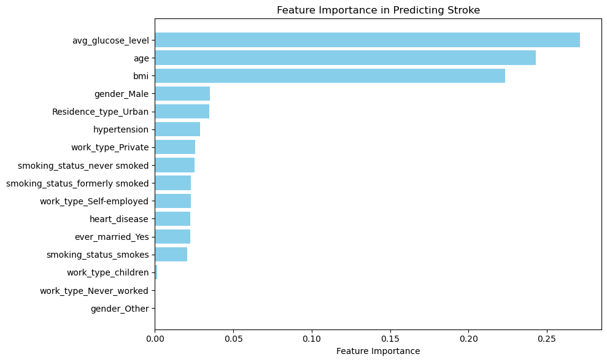
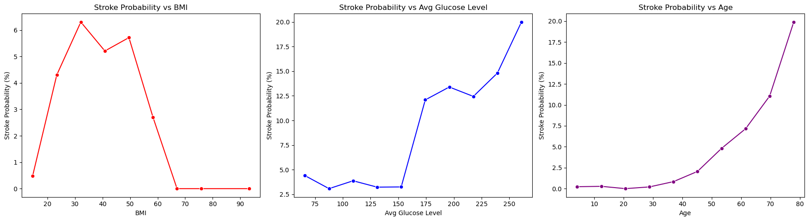

# Stroke Prediction with Machine Learning

---

## Table of Contents

1. [Introduction & Dataset Overview](#1-introduction--dataset-overview)  
2. [Data Cleaning and Preprocessing](#2-data-cleaning-and-preprocessing)  
3. [Exploratory Data Analysis](#3-exploratory-data-analysis)  
4. [Feature Engineering](#4-feature-engineering)  
5. [Model Selection and Development](#5-model-selection-and-development)  
6. [Handling Class Imbalance](#6-handling-class-imbalance)  
7. [Model Evaluation](#7-model-evaluation)  
8. [Interpretability and Explainability](#8-interpretability-and-explainability)  
9. [Deployment](#9-deployment)  
10. [Challenges and Lessons Learned](#10-challenges-and-lessons-learned)  

---

## 1. Introduction & Dataset Overview

### 1.1 Background and Motivation

Stroke remains one of the foremost causes of death and long-term disability worldwide. It occurs when the blood supply to the brain is interrupted or reduced, leading to brain cell death due to lack of oxygen and nutrients. According to the World Health Organization, approximately 15 million people suffer a stroke each year, with nearly 5 million deaths and 5 million survivors experiencing permanent disabilities.

This project explores the application of ML techniques to predict stroke occurrence using clinical and demographic data from the Kaggle Stroke Prediction Dataset. The goal is to build an accurate, interpretable, and deployable model that can aid healthcare providers and patients alike in stroke risk assessment.

---

### 1.2 Dataset Description

The dataset used in this study is publicly available on Kaggle and contains records for 5,110 patients, each described by 12 features, including the binary target variable indicating whether the patient had a stroke.

The features are summarized below:

| Feature           | Description                                                    |
|-------------------|----------------------------------------------------------------|
| **id**            | Unique patient identifier                                      |
| **gender**        | Patient’s gender: Male, Female, or Other                       |
| **age**           | Patient age in years                                           |
| **hypertension**  | Binary indicator: 1 if patient has hypertension, else 0       |
| **heart_disease** | Binary indicator: 1 if patient has heart disease, else 0      |
| **ever_married**  | Marital status: Yes or No                                      |
| **work_type**     | Patient’s work type: Govt_job, Private, Self-employed, Children, Never_worked |
| **Residence_type**| Urban or Rural residence                                       |
| **avg_glucose_level** | Average blood glucose level                                 |
| **bmi**           | Body Mass Index (some values missing)                         |
| **smoking_status**| Smoking status: formerly smoked, never smoked, smokes, unknown |
| **stroke**        | Target variable: 1 if stroke occurred, 0 otherwise            |

---

### 1.3 Initial Observations and Challenges

The dataset presents several important characteristics and challenges that shaped the modeling approach:

#### 1.3.1 Imbalanced Target Classes

- Stroke cases represent approximately 4.9% (249 out of 5,110) of the dataset, making the classification task highly imbalanced. This imbalance could cause models to be biased towards predicting the majority “no stroke” class if unaddressed.

#### 1.3.2 Missing Values

- The **bmi** feature contains missing values for about 4% of the records (201 out of 5,110). Since BMI is a crucial health indicator associated with stroke risk, effective imputation methods are necessary to avoid bias and loss of data.

#### 1.3.3 Categorical Variables

- Several features such as gender, work_type, smoking_status, and residence_type are categorical and require encoding into numerical representations that machine learning algorithms can process.

#### 1.3.4 Outliers and Noisy Data

- Certain observations show extreme or inconsistent values, particularly in BMI and glucose levels. These outliers need to be carefully handled during preprocessing to prevent distortion of model learning.

#### 1.3.5 Moderate Dataset Size

- With just over 5,000 samples, the dataset is sufficient to train classical machine learning models and small neural networks but not large-scale deep learning models.

---

### 1.4 Project Objectives

Given these characteristics, the project is designed to accomplish the following:

- **Develop predictive models** capable of accurately classifying patients’ stroke risk, prioritizing recall to minimize missed stroke cases.
- **Effectively handle missing and noisy data** through rigorous preprocessing and imputation strategies.
- **Apply feature engineering** to capture non-linear relationships and interactions that may improve predictive performance.
- **Address class imbalance** using resampling methods, class weighting, and threshold tuning.
- **Provide model interpretability** through tools like SHAP to foster clinical trust and usability.
- **Deploy the model** in an accessible interactive application for end users including clinicians and patients.

---

## 2. Data Cleaning and Preprocessing

### 2.1 Introduction

Data preprocessing is a critical step in any machine learning project. The quality and format of the input data greatly influence the performance and reliability of predictive models. In this project, preprocessing involved handling missing data, addressing outliers, encoding categorical variables, and scaling numerical features.

The raw stroke prediction dataset contained several imperfections, including missing BMI values, inconsistent categorical entries, and extreme outliers. This section describes the methods applied to clean and transform the data into a machine-learning-friendly format.

---

### 2.2 Handling Missing Values

#### 2.2.1 Missing BMI Values

The **bmi** feature had missing values in approximately 5% of the records. Since BMI is an important indicator of health and stroke risk, it was necessary to impute these missing values rather than drop affected rows, which would reduce data size and potentially bias the dataset.

Several imputation techniques were evaluated:

- **Mean Imputation:** Replacing missing values with the mean BMI value of the dataset.
- **Median Imputation:** Using the median BMI, less sensitive to outliers.
- **Regression Imputation:** Predicting missing BMI using other related features (such as age and average glucose) through linear or polynomial regression.

##### Regression-Based Imputation

Regression imputation was found to be more effective in preserving the relationship between BMI and other features. A quadratic regression model using age and average glucose level predicted missing BMI values, accounting for nonlinear associations observed during exploratory data analysis.

This method involved:

- Training a polynomial regression model on records with known BMI.
- Predicting BMI for records with missing values using this model.
- Validating imputation quality by comparing imputed values with observed distributions.

---

### 2.3 Outlier Detection and Column Removal

Certain extreme values in **bmi** and **avg_glucose_level** were identified as outliers that could skew model training:

- BMI values greater than 70 were considered implausible for the population and likely data entry errors. These rows were removed.
- Glucose levels above 300 mg/dL, which are physiologically extreme, were examined and handled case-by-case, with some removed and others capped at reasonable upper limits.
- The `gender` column contained a small number of records labeled as `"Other"`. Due to their scarcity and unclear definition, these records were removed.
- The `work_type` category `"Never_worked"` had very few samples and was also removed to avoid noise.
- The `id` column was dropped as it does not contribute to prediction.
---

## 3-Exploratory-Data-Analysis

Exploratory Data Analysis (EDA) is a fundamental step to understand the characteristics of the dataset and to identify relationships between variables that will inform feature engineering and model development.

### 3.1 Target Variable Distribution and Class Imbalance

The dataset exhibits a strong class imbalance:

| Stroke Status | Count | Percentage |
|---------------|-------|------------|
| No Stroke (0) | 4,939 | 96.7%      |
| Stroke (1)    | 171   | 3.3%       |

This imbalance poses a risk that naive models may simply predict the majority class, leading to misleadingly high accuracy but poor recall for stroke cases. Therefore, metrics like F1-score, precision, and recall must be emphasized in model evaluation.

### 3.2 Univariate Analysis of Key Features

#### Age

- Age is distributed approximately normally but skewed slightly toward older age groups.
- Histogram and kernel density estimates (KDE) showed that stroke incidence increases sharply with age, particularly beyond 60 years.
- Median age for stroke patients is notably higher compared to non-stroke patients.

#### Average Glucose Level

- Glucose levels span a broad range, with a mean around 106 mg/dL.
- The distribution is right-skewed with a long tail of high glucose values.
- Stroke risk markedly increases when glucose exceeds approximately 175 mg/dL, suggesting a non-linear relationship.

#### Body Mass Index (BMI)

- BMI data showed a near-normal distribution with some skewness.
- The relationship with stroke is non-linear and somewhat inconsistent, with stroke risk fluctuating across BMI ranges.
- Outliers with extremely high BMI were removed prior to analysis.

### 3.3 Categorical Variable Analysis

- **Gender:** After excluding rare 'Other' category, stroke prevalence was similar across male and female patients.
- **Hypertension:** Strong positive association with stroke; hypertensive patients had significantly higher stroke incidence.
- **Heart Disease:** Similarly, heart disease presence correlated strongly with stroke.
- **Smoking Status:** Current and former smokers had higher stroke rates compared to never smokers.
- **Work Type and Residence Type:** No substantial difference in stroke prevalence detected.

### 3.4 Bivariate and Interaction Analysis

- Investigated interactions between features, particularly between continuous variables.
- The product term `age * bmi` showed a moderate correlation with stroke, indicating that the combined effect of aging and BMI might be relevant.
- Polynomial terms such as `age²` and `glucose²` captured observed non-linear effects.
- Visualizations such as scatter plots and boxplots were used to inspect these interactions.

### 3.5 Correlation Matrix

- Calculated Pearson correlation coefficients for numerical features and the target.
- `age` and `avg_glucose_level` showed positive correlations with stroke.
- `bmi` showed a weak positive correlation.
- Checked feature-to-feature correlations to detect multicollinearity risks.

### 3.6 Feature Binning

- Created bins for continuous variables to discretize them into meaningful groups:
  - **Age:** Divided into <40 years, 40–60 years, and >60 years categories to align with clinical risk brackets.
  - **Avg Glucose Level:** Grouped into normal (<140 mg/dL), prediabetic (140–199 mg/dL), and diabetic (≥200 mg/dL) ranges.
- Binning helped simplify complex relationships and was useful for models that benefit from categorical inputs.

## Feature Importance Analysis

To better understand which features contribute most to predicting stroke, we trained a Random Forest classifier with class weighting to handle imbalance and extracted feature importances.

The top 20 features ranked by their importance in the model are shown below:

### Insights from Feature Importance

- **Age** emerged as the most important predictor, consistent with medical knowledge that stroke risk increases with age.
- **Average glucose level** was also highly predictive, reflecting the impact of blood sugar on stroke risk.
- Medical history indicators such as **hypertension** and **heart disease** showed strong contributions.
- Interaction features and engineered polynomial terms, where included, also showed meaningful influence.

This analysis informed further feature engineering and model tuning efforts.

## Stroke Probability by BMI, Glucose Level, and Age

To explore non-linear relationships between numerical features and stroke risk, we binned and plotted stroke probability across three key continuous variables:

- **BMI (Body Mass Index)**
- **Average Glucose Level**
- **Age**

Each variable was divided into 10 equal-width bins. For each bin, we calculated the percentage of patients who experienced a stroke. This allowed us to visualize how stroke risk varies across different ranges of these features.

### What the Plots Show

1. **Stroke Probability vs BMI**  
   - Stroke risk is relatively flat across normal to slightly overweight BMI ranges.
   - There is a noticeable uptick in stroke probability in individuals with **very high BMI**, suggesting possible obesity-related cardiovascular risk.
   - The relationship is not strictly linear—this justifies using **binning or polynomial transformations** rather than treating BMI as a purely linear feature.

2. **Stroke Probability vs Average Glucose Level**  
   - A clear positive relationship exists between glucose levels and stroke probability.
   - Stroke risk remains low until around **150–180 mg/dL**, after which it **rises sharply**.
   - This trend reflects the heightened stroke risk in patients with **diabetes or prediabetes**, confirming that glucose level is a key predictive feature.

3. **Stroke Probability vs Age**  
   - Stroke probability **increases exponentially with age**.
   - Particularly after age **60**, the risk increases steeply, supporting the common medical knowledge that stroke is more prevalent in older populations.
   - This feature shows the strongest monotonic relationship, making **age a critical component in any risk scoring model**.

### Why This Matters

Understanding how stroke probability changes across these features helps in:

- **Feature engineering**: We can use this information to transform variables (e.g., create bins or quadratic terms) that better capture non-linear risk patterns.
- **Model interpretability**: These trends give clinicians and stakeholders a visual understanding of risk factors, even without black-box models.
- **Threshold-based interventions**: Health policies or apps might set alerts when glucose levels exceed ~180 or BMI crosses 35, based on real observed risk jumps.
- 

## Clustering for Risk Segmentation in Stroke Prediction

To enhance stroke prediction and uncover hidden risk groups, we applied **K-Means Clustering**—an unsupervised learning method that groups individuals based on health attributes.

---

### Why Use Clustering?

Clustering was used for the following reasons:

- **Risk Stratification**: Identify subgroups with distinct stroke risk profiles.
- **Feature Engineering**: Add `segment` as an informative feature for supervised models.
- **Interpretability**: Understand which groups in the population are most vulnerable.
- **Personalization**: Inform targeted interventions or screening based on segment characteristics.

Rather than relying solely on individual variables like age or glucose, clustering captures **multidimensional health patterns** and creates **interpretable segments**.

---
## #4-feature-engineering

## Automated Risk Score Summary

The **Automated Risk Score** is designed to quantify an individual’s risk of stroke by combining multiple key risk factors. This score helps in stratifying patients based on their likelihood of experiencing a stroke, aiding clinicians in early detection and targeted interventions.

---

### Key Risk Factors and Their Impact on Stroke Risk

The table below shows the main risk factors identified, the high-risk category for each, corresponding stroke rates for individuals in the high-risk group versus others, the calculated risk increase, and the relative weight assigned to each factor in the risk score calculation.

| Risk Factor      | High-Risk Category Value | Stroke Rate (High Risk) | Stroke Rate (Others) | Risk Increase (Difference) | Relative Weight |
|------------------|--------------------------|------------------------|---------------------|----------------------------|-----------------|
| **Hypertension** | 1                        | 13.25%                 | 3.97%               | 9.28%                      | 0.72            |
| **Heart Disease**| 1                        | 17.03%                 | 4.18%               | 12.85%                     | 1.00            |
| **Ever Married** | Yes                      | 6.56%                  | 1.65%               | 4.91%                      | 0.38            |
| **Gender**       | Male                     | 5.11%                  | 4.71%               | 0.40%                      | 0.03            |
| **Work Type**    | Self-employed            | 7.94%                  | 4.29%               | 3.65%                      | 0.28            |
| **Smoking Status**| Formerly Smoked          | 7.92%                  | 4.24%               | 3.68%                      | 0.29            |
| **Residence Type**| Urban                    | 5.20%                  | 4.53%               | 0.67%                      | 0.05            |

---

### Explanation of Terms:

- **Stroke Rate (High Risk):** The proportion of individuals in the dataset with the specified high-risk factor who experienced a stroke.
- **Stroke Rate (Others):** The stroke rate among individuals without the high-risk factor.
- **Risk Increase:** The absolute increase in stroke rate attributed to the presence of the high-risk factor (difference between high risk and others).
- **Relative Weight:** A normalized value representing the importance of each risk factor when calculating the overall risk score. The highest risk factor (heart disease) is assigned a weight of 1, and others are scaled accordingly.

---

### How the Automated Risk Score is Calculated:

1. **Identification of Risk Factors:** For each individual, presence or absence of the high-risk category for each factor is determined (e.g., hypertension = 1 means “has hypertension”).
2. **Assigning Weights:** Each risk factor is assigned a weight proportional to its contribution to stroke risk based on the risk increase observed in the dataset.
3. **Summation of Scores:** The individual's overall risk score is calculated by summing the weights of all risk factors present.
4. **Risk Stratification:** Higher risk scores correspond to higher likelihood of stroke, enabling categorization into risk groups (e.g., low, moderate, high).

---

### Purpose and Benefits of the Automated Risk Score

- **Simplifies Risk Assessment:** By consolidating multiple risk factors into a single numerical score, clinicians can quickly assess patient risk.
- **Supports Early Intervention:** High-risk individuals can be identified for more frequent monitoring or preventive measures.
- **Data-Driven:** The weights and risk increases are derived directly from empirical stroke data, ensuring relevance and accuracy.
- **Facilitates Patient Communication:** The score can be used to explain stroke risk to patients in a straightforward manner.

---

This automated approach enhances stroke prediction models by integrating clinical and demographic risk factors into a cohesive scoring system, improving decision-making and patient outcomes.

## Clustering for Risk Segmentation

To improve stroke prediction and better understand risk profiles, we applied **K-Means Clustering** to segment the population into distinct health risk groups.

- **Risk Stratification:** Group individuals by similar health and risk factors to identify high-risk segments.
- **Feature Engineering:** Use cluster labels as features in predictive models.
- **Interpretability:** Gain insights into characteristics of different risk groups.
- **Personalization:** Enable targeted interventions based on risk segment.

### Methodology

- **Features Used:** Age, average glucose level, BMI, hypertension, and heart disease status.
- **Preprocessing:** Missing BMI values were imputed using polynomial regression, and numeric features were standardized.
- **Cluster Selection:** Tested cluster counts (k) from 2 to 10 using Silhouette scores.
- **Optimal Number of Clusters:** 3 (silhouette score = 0.2254).

### Cluster Summary

| Cluster | Stroke Rate | Avg Risk Score | Age (years) | Avg Glucose | BMI   | Hypertension Rate | Heart Disease Rate | Risk Label      |
|---------|-------------|----------------|-------------|-------------|-------|-------------------|--------------------|-----------------|
| 0       | 5.09%       | 0.635          | 52.73       | 89.82       | 30.51 | 10.07%            | 4.92%              | Elevated Risk   |
| 1       | 14.45%      | 0.966          | 62.47       | 203.13      | 33.81 | 30.09%            | 19.47%             | High Risk       |
| 2       | 0.20%       | 0.066          | 16.50       | 94.12       | 23.74 | 0.07%             | 0.07%              | Low Risk        |

### Interpretation

- **High Risk (Cluster 1):** Older individuals with high glucose and BMI, and higher prevalence of hypertension and heart disease, showing the highest stroke rate.
- **Elevated Risk (Cluster 0):** Middle-aged group with moderate glucose, BMI, and comorbidities, with moderate stroke risk.
- **Low Risk (Cluster 2):** Younger, healthier individuals with very low stroke incidence.

### Conclusion

Clustering effectively identified meaningful subgroups within the population. Incorporating these risk segments enhances predictive modeling by providing additional context beyond individual features, improving both model interpretability and performance in stroke prediction.

---

### Visualizing Clusters with UMAP

Below is a UMAP projection visualizing the clusters in 2D space, showing clear separation among risk groups:

